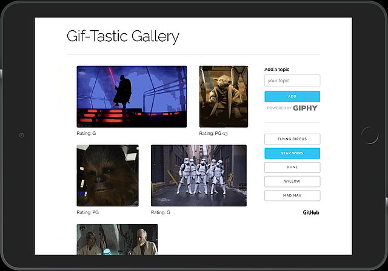

# Gif-Tastic Gallery

Gif-Tastic Gallery searches the [Giphy API](https://developers.giphy.com/) based on key words
selected by the user. Ten results are displayed for each search. Users may click on images to
play/pause the gifs.

See [Gif-Tastic Gallery](https://median-man.github.io/Gif-Tastic-Gallery/) on Github Pages for a live demo.

## Getting Started

Clone the repository locally and open up index.html in your 
web browser. GifTastic uses the [Giphy API](https://developers.giphy.com/)
to retrieve the gif files. You must be connected to the internet in
order for GifTastic to work.

## Educational Purpose

I'm building this app to gain some practical experience using jQuery's AJAX method as well as client testing with MochaJS.

## Testing
There are a small collection of unit tests available by opening /test/index.html. The tests use MochaJS and Chai
Javascript libraries by loading them from CDNs. If NodeJS is installed on the local environment, simply run `npm test` to open the unit tests in the browser.

## Links
* [Gif-Tastic Gallery](https://median-man.github.io/Gif-Tastic-Gallery/)
* [Source Code](https://github.com/median-man/GifTastic)
* [Giphy API](https://developers.giphy.com/)
* [jQuery](http://jquery.com/)

## Author
John Desrosiers

## Acknowledgements
* [Skeleton](http://getskeleton.com/) boilerplate CSS is used in GifTastic.
* [Big Smile](http://findicons.com/icon/39186/big_smile) icon by Rokey.
